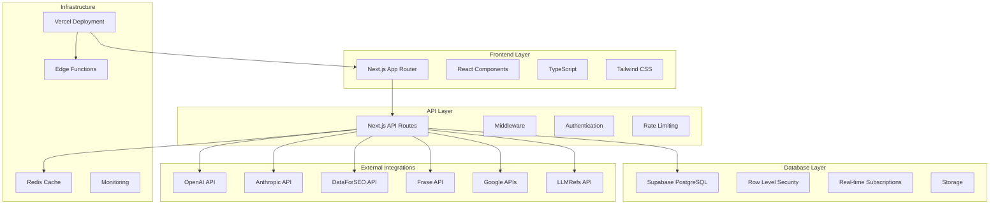
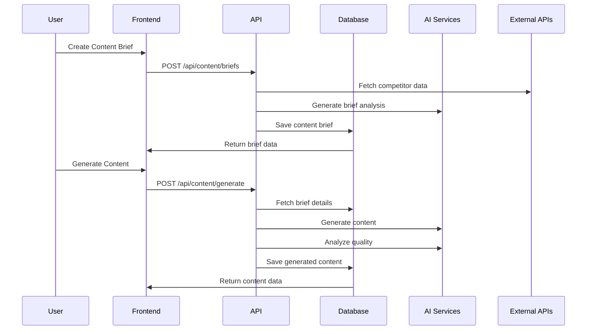
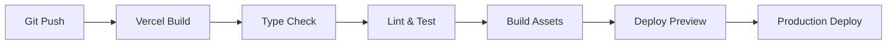

# Architecture Overview

Content Command is built as a modern, scalable web application using Next.js and Supabase. This document outlines the system architecture, design patterns, and key technical decisions.

## System Architecture



## Technology Stack

### Frontend
- **Next.js 14**: React framework with App Router for modern routing and layouts
- **React 18**: UI library with concurrent features and server components
- **TypeScript**: Type-safe JavaScript for better developer experience
- **Tailwind CSS**: Utility-first CSS framework for rapid UI development
- **shadcn/ui**: High-quality, accessible component library
- **Radix UI**: Unstyled, accessible UI primitives

### Backend
- **Next.js API Routes**: Serverless API endpoints with automatic deployment
- **Supabase**: Backend-as-a-Service with PostgreSQL, Auth, and real-time features
- **Zod**: Runtime type validation and schema parsing
- **Upstash Redis**: Serverless Redis for caching and rate limiting

### Database
- **PostgreSQL**: Robust relational database via Supabase
- **Row Level Security (RLS)**: Database-level security for multi-tenancy
- **Real-time Subscriptions**: Live updates using Supabase real-time
- **Automated Backups**: Built-in backup and point-in-time recovery

### AI & Integrations
- **OpenAI GPT-4**: Primary content generation model
- **Anthropic Claude**: Alternative content generation and analysis
- **DataForSEO**: Competitive analysis and SERP data
- **Frase**: Content optimization and analysis
- **Google APIs**: Search Console and Analytics integration
- **LLMRefs**: AI citation tracking and optimization

## Application Structure

```
contentcommand/
├── app/                    # Next.js App Router
│   ├── (auth)/            # Authentication pages
│   ├── api/               # API routes
│   ├── dashboard/         # Main application pages
│   └── globals.css        # Global styles
├── components/            # React components
│   ├── ui/               # Base UI components
│   ├── dashboard/        # Dashboard-specific components
│   ├── content/          # Content management components
│   ├── integrations/     # Integration components
│   └── clients/          # Client management components
├── lib/                   # Utility libraries
│   ├── supabase/         # Database queries and client
│   ├── ai/               # AI integration logic
│   ├── integrations/     # External API integrations
│   ├── auth/             # Authentication utilities
│   └── utils.ts          # General utilities
├── types/                 # TypeScript type definitions
├── supabase/             # Database migrations and config
└── docs/                 # Documentation
```

## Design Patterns

### Multi-Tenant Architecture

Content Command uses a hierarchical multi-tenant model:

```
Organization (Tenant)
├── Members (Users with Roles)
├── Clients
│   ├── Competitors
│   ├── Content Briefs
│   └── Generated Content
└── Integrations
```

**Key Features:**
- Row Level Security (RLS) for data isolation
- Role-based access control (Owner, Admin, Member)
- Shared integrations at organization level
- Client-specific content and analytics

### API Design

**RESTful Conventions:**
- `GET /api/clients` - List clients
- `POST /api/clients` - Create client
- `GET /api/clients/[id]` - Get specific client
- `PUT /api/clients/[id]` - Update client
- `DELETE /api/clients/[id]` - Delete client

**Error Handling:**
```typescript
// Consistent error response format
{
  error: string;
  message: string;
  code?: string;
  details?: any;
}
```

**Authentication:**
- JWT tokens via Supabase Auth
- Automatic token refresh
- Role-based route protection

### Component Architecture

**Atomic Design Principles:**
- **Atoms**: Basic UI elements (Button, Input, Badge)
- **Molecules**: Simple component combinations (SearchBox, FormField)
- **Organisms**: Complex UI sections (Sidebar, ContentEditor)
- **Templates**: Page layouts and structures
- **Pages**: Complete page implementations

**State Management:**
- Server state via React Query (TanStack Query)
- Client state via React hooks (useState, useReducer)
- Form state via React Hook Form
- URL state via Next.js router

## Data Flow

### Content Generation Workflow



### Real-time Updates

```typescript
// Real-time subscription example
useEffect(() => {
  const subscription = supabase
    .channel(`content_${clientId}`)
    .on('postgres_changes', {
      event: '*',
      schema: 'public',
      table: 'generated_content',
      filter: `client_id=eq.${clientId}`
    }, (payload) => {
      // Handle real-time content updates
      updateContentList(payload);
    })
    .subscribe();

  return () => subscription.unsubscribe();
}, [clientId]);
```

## Security Architecture

### Authentication & Authorization

**Multi-layer Security:**
1. **Supabase Auth**: JWT token validation
2. **RLS Policies**: Database-level access control
3. **API Middleware**: Route-level authentication
4. **Component Guards**: UI-level access control

**RLS Policy Example:**
```sql
-- Users can only access their organization's clients
CREATE POLICY "Users can view their clients"
ON clients FOR SELECT
USING (
  id IN (
    SELECT c.id FROM clients c
    JOIN organization_members om ON c.org_id = om.org_id
    WHERE om.user_id = auth.uid()
  )
);
```

### Data Protection

- **Encryption at Rest**: Supabase handles database encryption
- **Encryption in Transit**: HTTPS/TLS for all communications
- **API Key Security**: Environment variables and secure storage
- **Rate Limiting**: Prevent abuse and ensure fair usage
- **Input Validation**: Zod schemas for all API inputs

## Performance Optimization

### Caching Strategy

**Multi-level Caching:**
1. **Browser Cache**: Static assets and API responses
2. **CDN Cache**: Vercel Edge Network for global distribution
3. **Redis Cache**: Server-side caching for expensive operations
4. **Database Cache**: Supabase connection pooling and query optimization

**Cache Implementation:**
```typescript
// Redis caching utility
export async function withCache<T>(
  key: string,
  fetcher: () => Promise<T>,
  ttl: number = 300
): Promise<T> {
  const cached = await redis.get(key);
  if (cached) return JSON.parse(cached);
  
  const data = await fetcher();
  await redis.setex(key, ttl, JSON.stringify(data));
  return data;
}
```

### Database Optimization

**Indexing Strategy:**
```sql
-- Performance indexes
CREATE INDEX idx_content_client_status ON generated_content(client_id, status);
CREATE INDEX idx_briefs_client_created ON content_briefs(client_id, created_at DESC);
CREATE INDEX idx_usage_client_date ON ai_usage_tracking(client_id, created_at);
```

**Query Optimization:**
- Use Supabase query builder for type safety
- Implement pagination for large datasets
- Use select() to limit returned columns
- Leverage RLS for automatic filtering

## Monitoring & Observability

### Application Monitoring

**Vercel Analytics:**
- Performance metrics
- Error tracking
- User analytics
- Core Web Vitals

**Supabase Dashboard:**
- Database performance
- API usage statistics
- Authentication metrics
- Real-time connections

### Custom Monitoring

```typescript
// API request logging
export async function logApiRequest(
  endpoint: string,
  method: string,
  statusCode: number,
  responseTime: number,
  userId?: string
) {
  await supabase
    .from('api_request_logs')
    .insert({
      endpoint,
      method,
      status_code: statusCode,
      response_time_ms: responseTime,
      user_id: userId,
      created_at: new Date().toISOString()
    });
}
```

## Scalability Considerations

### Horizontal Scaling

- **Serverless Architecture**: Automatic scaling with Vercel
- **Database Scaling**: Supabase handles connection pooling and read replicas
- **CDN Distribution**: Global edge network for static assets
- **Stateless Design**: No server-side session storage

### Performance Limits

**Current Limits:**
- Supabase: 500 concurrent connections
- Vercel: 100GB bandwidth per month (Pro plan)
- OpenAI: Rate limits based on tier
- Redis: 10,000 commands per second

**Scaling Strategies:**
- Implement request queuing for AI operations
- Use database read replicas for analytics
- Consider microservices for heavy operations
- Implement intelligent caching strategies

## Development Workflow

### Code Organization

**Feature-based Structure:**
```
components/
├── content/
│   ├── brief-card.tsx
│   ├── content-editor.tsx
│   └── __tests__/
├── integrations/
│   ├── health-status.tsx
│   ├── provider-card.tsx
│   └── __tests__/
└── ui/
    ├── button.tsx
    ├── card.tsx
    └── __tests__/
```

### Testing Strategy

- **Unit Tests**: Jest + React Testing Library
- **Integration Tests**: API route testing
- **E2E Tests**: Playwright for critical user flows
- **Type Safety**: TypeScript for compile-time checks

### Deployment Pipeline



## Future Architecture Considerations

### Potential Enhancements

1. **Microservices**: Extract AI processing to dedicated services
2. **Event Sourcing**: Implement for audit trails and analytics
3. **GraphQL**: Consider for complex data fetching requirements
4. **WebSockets**: Enhanced real-time features beyond Supabase
5. **Mobile Apps**: React Native or native mobile applications

### Technology Migrations

**Monitoring for:**
- Next.js updates and new features
- Supabase feature releases
- AI model improvements and new providers
- Performance optimization opportunities